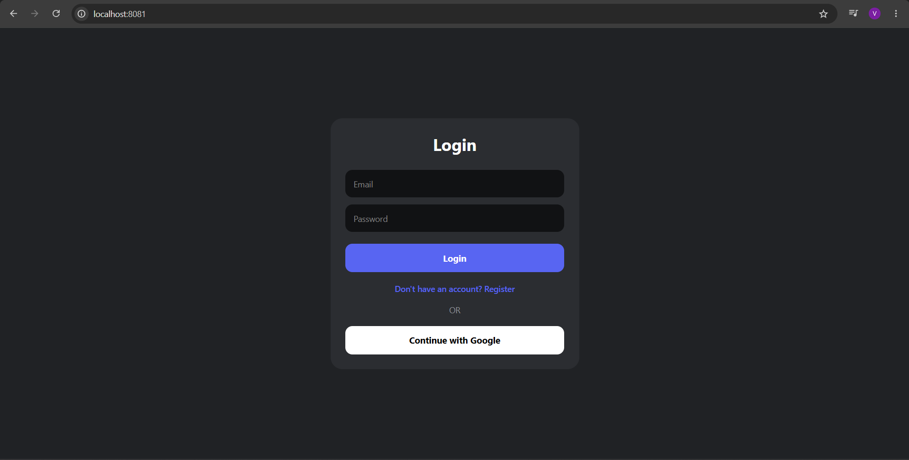
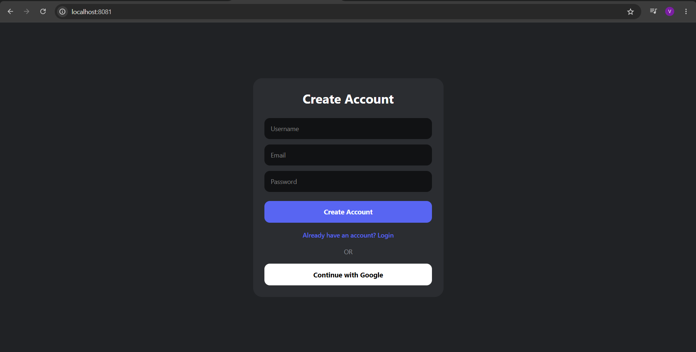
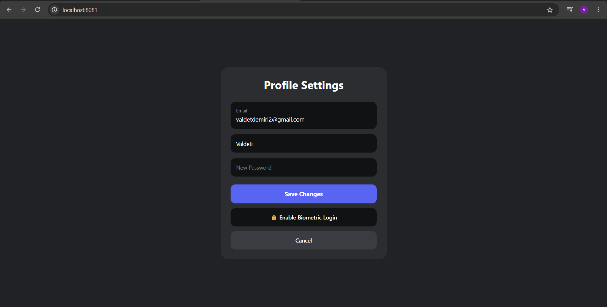
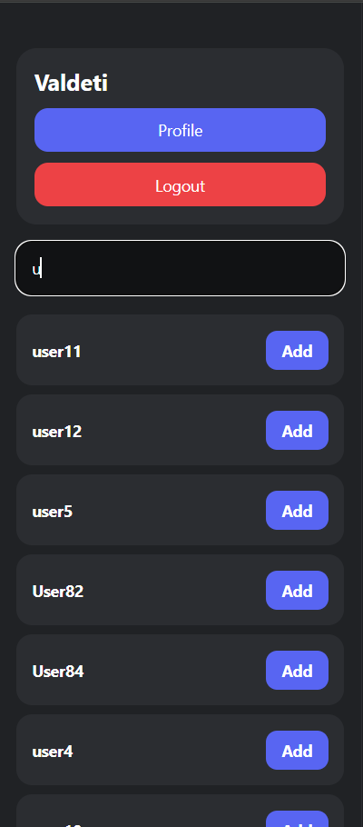
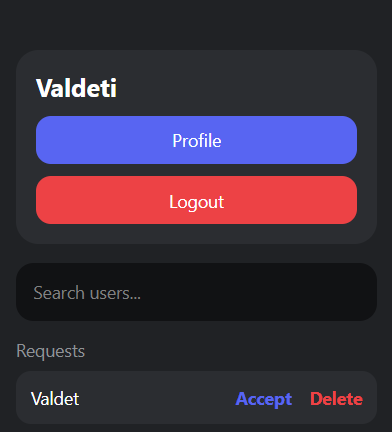
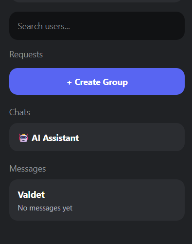
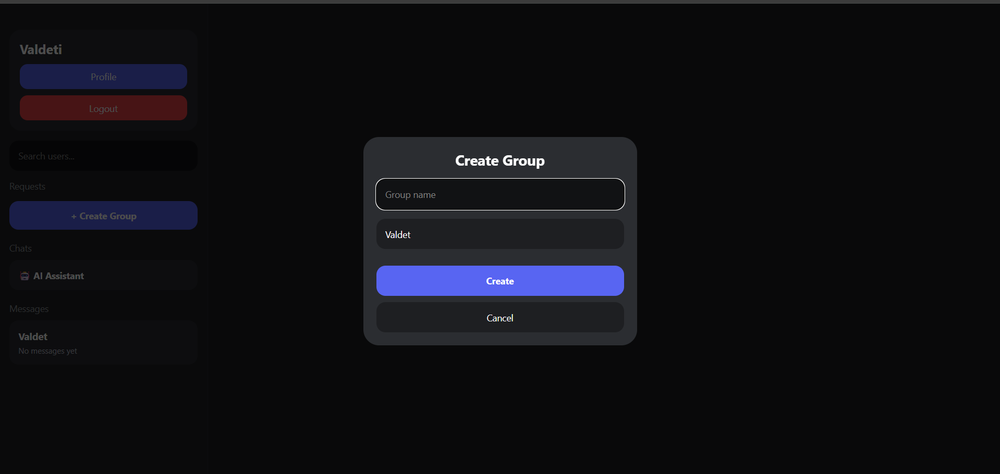
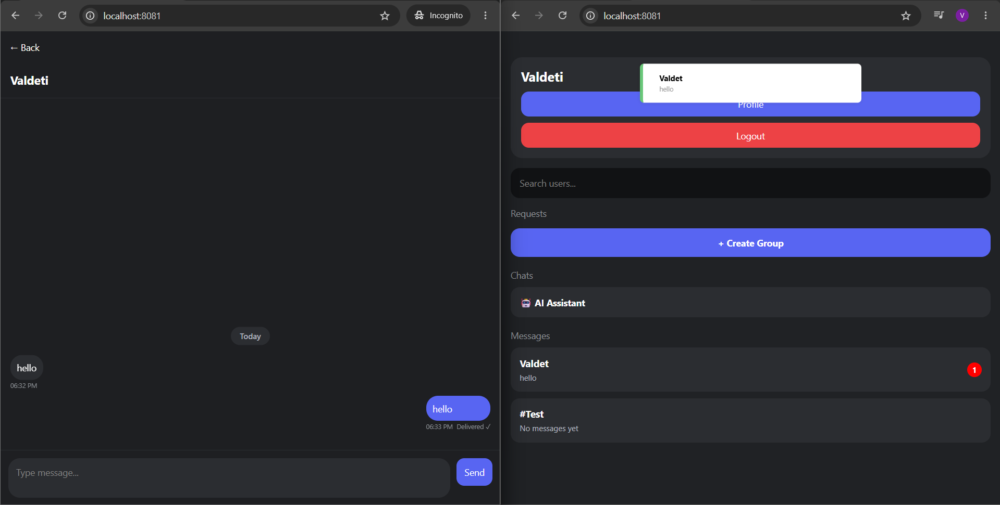
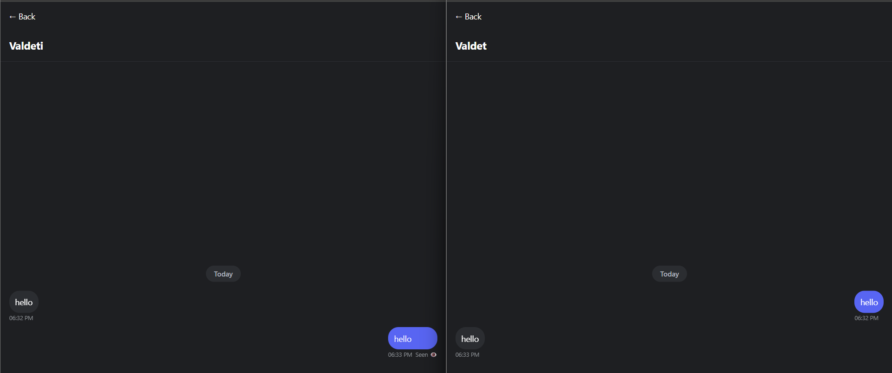
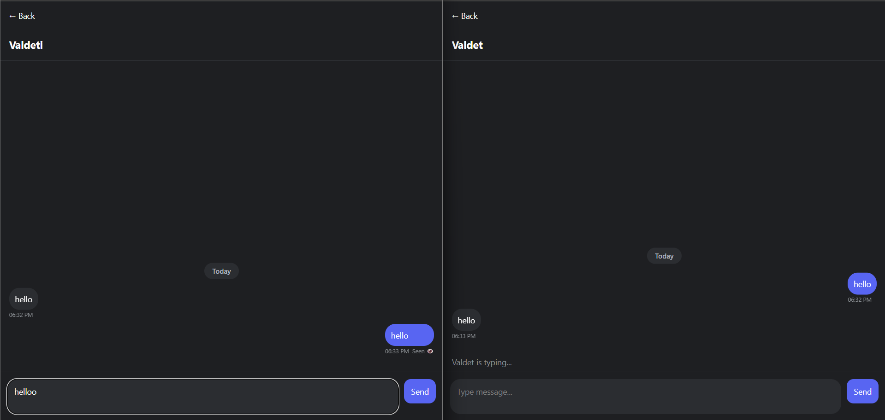

# Chat App

A modern real-time mobile chat application built with React Native, Expo, and Firebase.

---

# Features

- User Authentication (Firebase Auth)
- Real-Time Messaging
- Friend Requests
- Add Friends
- Group Chats
- AI Assistant Chat
- Seen Messages
- Unread Message Counter
- Push Notifications
- Search Users
- Markdown AI Responses
- Fingerprint Authentication
- Automatic Cloud Synchronization
- Local Chat Storage
- Offline Support

---

# Tech Stack

## Mobile Frontend
- React Native
- Expo
- JavaScript

## Cloud Backend
- Firebase Authentication
- Firebase Firestore Database
- Firebase Cloud Messaging

## AI
- OpenRouter API
- GPT-4o Mini

## Local Storage
- AsyncStorage

---

# Installation

## Clone repository

```bash
git clone https://github.com/Valdet2/Chat-App.git
```

## Install dependencies

```bash
npm install
```

## Start project

```bash
npx expo start
```

---

# Environment Variables

Create:

```env
.env
```

Add:

```env
EXPO_PUBLIC_FIREBASE_API_KEY=YOUR_KEY
EXPO_PUBLIC_FIREBASE_AUTH_DOMAIN=YOUR_DOMAIN
EXPO_PUBLIC_FIREBASE_PROJECT_ID=YOUR_PROJECT_ID
EXPO_PUBLIC_FIREBASE_STORAGE_BUCKET=YOUR_BUCKET
EXPO_PUBLIC_FIREBASE_MESSAGING_SENDER_ID=YOUR_SENDER_ID
EXPO_PUBLIC_FIREBASE_APP_ID=YOUR_APP_ID

EXPO_PUBLIC_OPENROUTER_API_KEY=YOUR_OPENROUTER_API_KEY
```

---

# Firebase Setup

Create Firebase project:

- Enable Authentication
- Enable Email/Password login
- Create Firestore database
- Enable Firebase Cloud Messaging (Optional)

---

# Testing

## Local Testing

- Login/Register works
- Search/Add a User
- Messages in Real Time
- Seen/Delivered Messages
- Friend Requests
- Group Chats
- AI Assistant works
- Push Notifications work

---

# Screenshots

## Login Screen


## Register Screen


## Home Screen


## Profile Settings


## Search Users


## Friend Requests


## Friends List


## Create Group


## Group Chat


## AI Chat


## Delivered Messages


## Seen Messages


## Typing Indicator


## Group Settings


---

# Live Web Demo

https://chatapp-12d97.web.app

---

# Author

Valdet Demiri